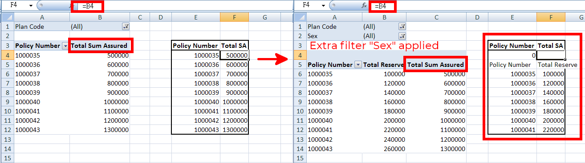
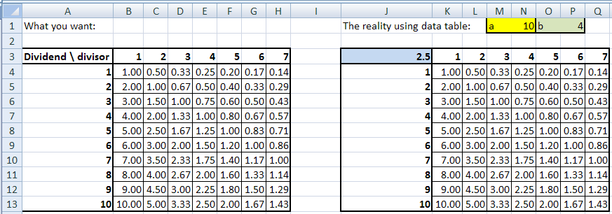

title: Logic-Layout Dependency Problem

post-url: why-are-excel-workbooks-difficult-to-follow-and-check

# Introduction

[Model-view-controller (MVC)](http://en.wikipedia.org/wiki/Model%E2%80%93view%E2%80%93controller), first described by Trygve Reenskaug in 1979, is an architectural pattern widely used in software engineering. To say in simple words, one of MVC’s virtue is the separation of business logic and presentation layer, which could reduce the complexity in architectural design and to increase flexibility and maintability of code. Either the layout or the business logic can be changed without affecting the other.

# Excel’s logic and layout dependency

With the feature of using formula in cells, Excel can be considered as a programming interface, allowing logic to be built in and output to be shown. In this way we can regard the formula as the business logic, and the placement of cells in the workbook as the presentation layer.

Here the problem comes. The basic design of Excel makes the business logic and layout largely dependent of each other, making the separation difficult.
As a functional workbook, it should work fine even any cell is moved or any column is inserted at any place. Excel already does a great job in the automatic adjustment, but there are still many cases of failures.

## Example 1 – VLOOKUP

The third attribute of the [`VLOOKUP`](https://support.office.com/en-us/article/VLOOKUP-function-0bbc8083-26fe-4963-8ab8-93a18ad188a1) function is a simple example. When the column of the table is moved, the function will fail because the column number does not adjust to the change automatically. Some people try to avoid this problem by using a number above the column. But this is not the best solution as it still suffers from the logic layout dependency. The proper solution will be illustrated in another article.


## Example 2 – INDIRECT

The [`INDIRECT`](https://support.office.com/en-us/article/INDIRECT-function-474b3a3a-8a26-4f44-b491-92b6306fa261) function fails when any kind of layout changes is made, because the `INDIRECT` function accepts a string, not a cell reference. The string will never adapt to the layout changes automatically.


## Example 3 – Pivot Tables

When a cell refers to the values in a pivot table using the ordinary way (A1, C5, etc.), these cell references do not change automatically when the layout of the pivot table is changed, e.g. a new field is added.



## Example 4 – Data Tables

Excel specifies a format used for data tables. Formula must be placed in the designated cells for data tables to work properly. In such way the logic and layout are closely tied together and cannot be separated.



## Example 5 – VBA

VBA programs are the most horrible places having such problems. Many VBA programs are so poorly written that a) inserting/deleting rows and columns, or b) simply moving cells and renaming worksheets, make them failed. The below code snippet is an illustration – it contains the references “B6″,  “output” and “A10″. Whenever the cells `B6` and `A10` are moved, or the worksheet `output` is renamed or deleted, the snippet will fail.

```vb
Public Sub testing()
  input_plancode = Range("B6").Value
  Worksheets("output").Range("A10").Value = input_plancode
End Sub
```

# Summary

The grid layout and the labeling of rows and columns (e.g. a cell is called `E9`) are great obstacles for good stability, readability and maintainability of the spreadsheets. They make the separation of logic and layout so difficult. Possible solutions to the above issues will be discussed in the upcoming articles.

The key concept is to reduce the interdependency between logic and layout in Excel. It will make our life with Excel much easier. For programmers, such concept is even more crucial when writing code.
